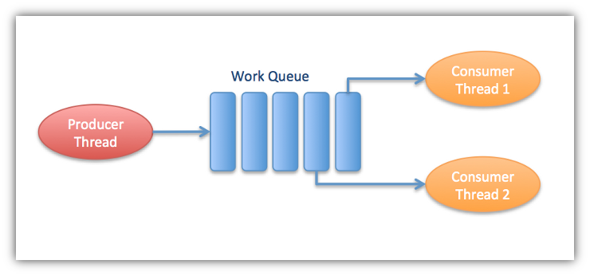

# Multithreaded-Worker-Queue

Build a multithreaded application is to devise a means to distribute tasks between threads so they can be processed concurrently.
Queues are good devices for transferring work items from one thread to another.

## Producer-Consumer Model

One approach to multithreading is the producer-consumer model where one thread – **the producer** – places work items in a queue and one or more **consumer threads** waits for and removes the items to process. 
For the work queue class we’ll use one producer thread and two consumer threads.

When a consumer thread runs it checks the number of items on the queue. 
If there are one or more work items on the queue the consumer removes one and processes it. 
If none are available the consumer waits for the producer to add items to the queue. These steps are repreated continually for the lifetime of the application.

